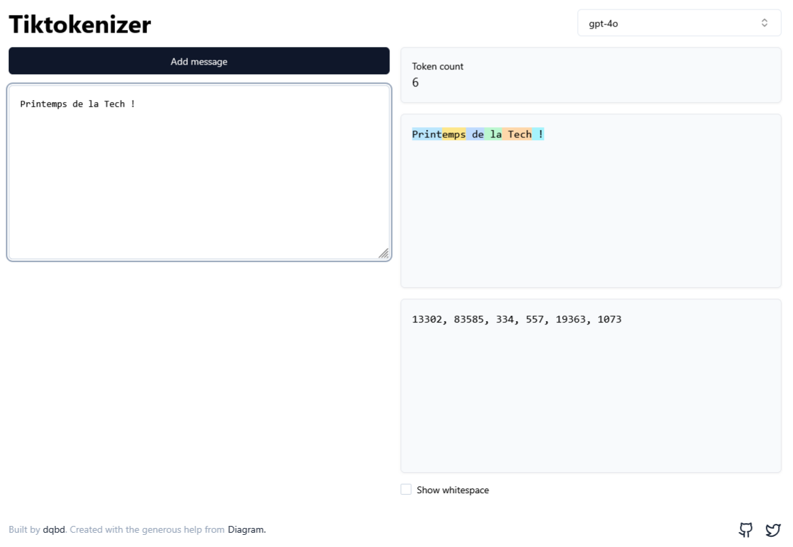
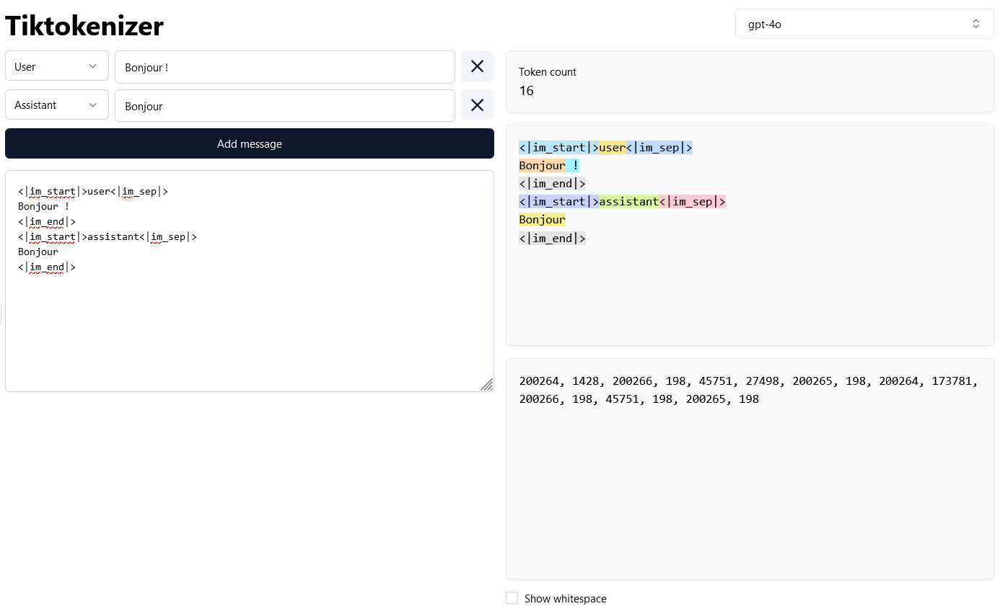
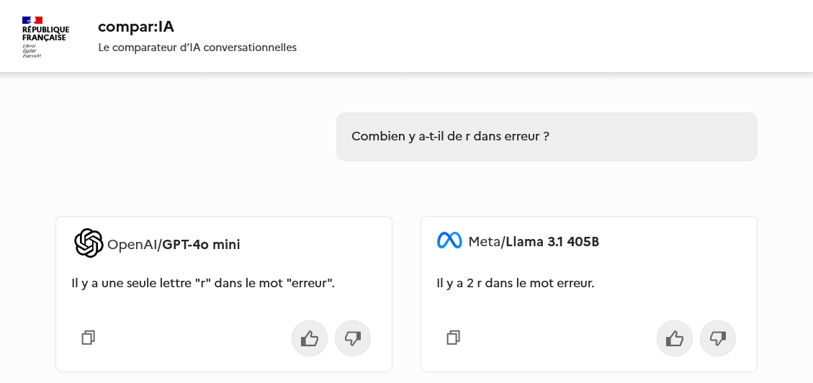
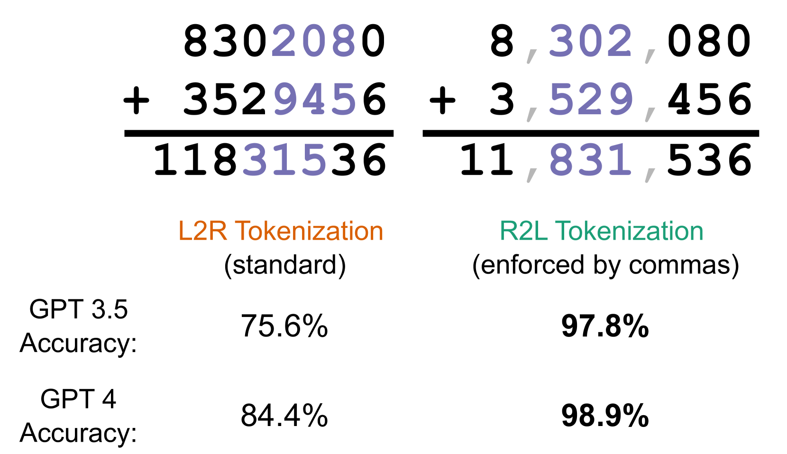
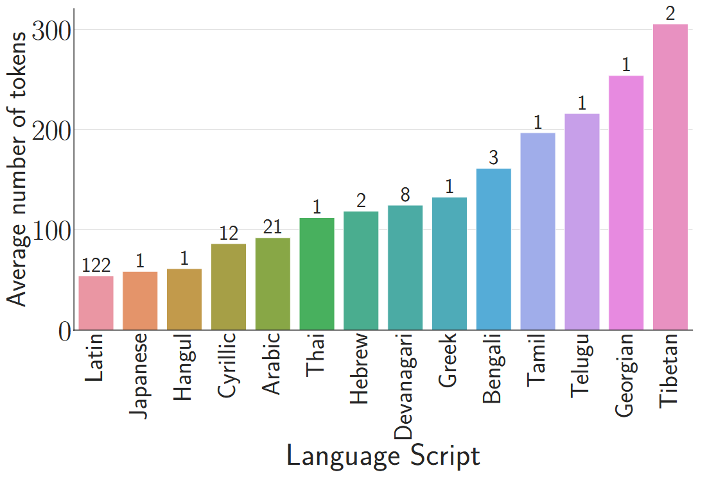
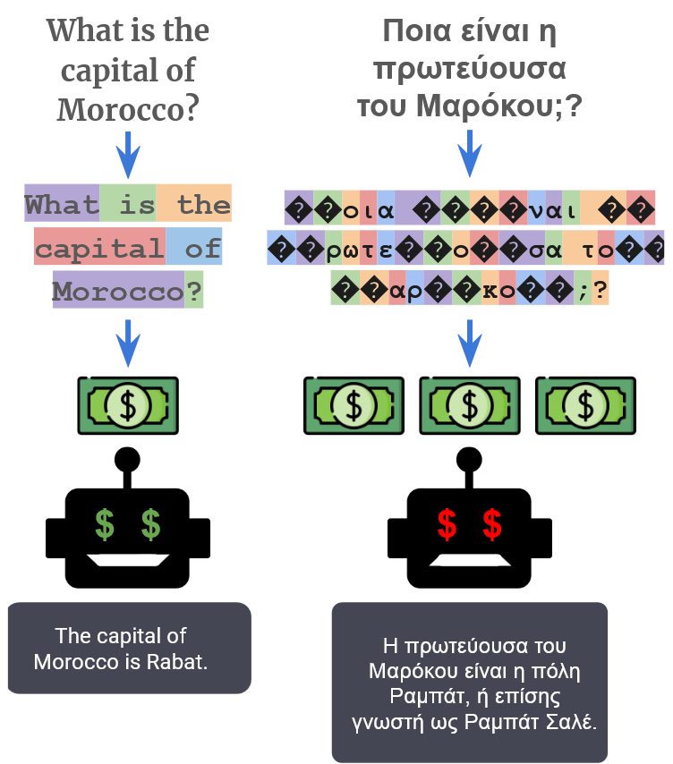

<style>
/* 
Couleurs : 
    - #69bfbc
    - #e12967
    - #6d6cae
    - #f3956e
    - #fbbb2b
    - #222d4e
*/

:root.lead {
    text-align: center;
    background: url(images/fond.png) no-repeat right bottom, linear-gradient(0deg, #ead283, #91c4aa, #6abfbc);
}

:root.lead h1,h2,h3 {
    color: white;
    text-shadow: 2px 2px 4px rgba(0, 0, 0, 0.2);
    font-size: 2rem;
}

:root h1,h2,h3 {
    color: #e12967;
}

:root.section-title {
    text-align: center;
    background: url(images/fond.png) no-repeat right bottom, linear-gradient(45deg, #F5D07A , #F5B784 );
}
:root.section-title h1 {
    color: white;
    font-size: 2.8rem;
    text-shadow: 2px 2px 4px rgba(0, 0, 0, 0.5);
}
</style>

<!-- Slide de présentation -->
<!-- _paginate: skip -->
<!-- _class: lead -->
<!-- _header: "" -->
<!-- _footer: "" -->


# Comprendre les tokens par la pratique

---

<!-- _paginate: skip -->
<!-- _header: "" -->


## Hakim Cheikh
**Data Scientist chez Valeuriad depuis 3 ans**

_En mission chez France Travail_

---

## Pré-requis

:snake: Python niveau A1

## Déroulé

1. Notions de traitement du langage
2. Implémentation d'un tokenizer
3. Réfléxions et conclusion

---

<!-- _paginate: skip -->
<!-- _class: section-title -->
<!-- _footer: "" -->

# Notions de traitement du langage

---

### _Quelques notions de NLP_

**NLP** : **N**atural **L**angage **P**rocessing

Exemples de cas d'usage : 

- Catégorisation de contenu
- Extraction d'entités 
- Analyse de sentiments
- Traduction
- Résumé
- Génération de texte

---

### _Quelques notions de NLP_ : Décompositions en mots

Les algorithmes fonctionnent à partir d'une représentation sous forme numérique.

```python
text = "Bienvenu au Printemps de la Tech 2025"
```

**Première approche :** décomposer le texte sur les espaces puis construire un vocabulaire

```python
words = text.split(" ")
# ['Bienvenu', 'au', 'Printemps', 'de', 'la', 'Tech', '2025']

vocab = {word: i for i, word in enumerate(words)}

text_ids = [vocab[word] for word in words]
text_ids
# [0, 1, 2, 3, 4, 5, 6]
```

---

### _Quelques notions de NLP_ : Décompositions en mots

```python
text
# "Bienvenu au Printemps de la Tech 2025"

text_ids
# [0, 1, 2, 3, 4, 5, 6]

vocab
# {'Bienvenu': 0, 'au': 1, 'Printemps': 2, 'de': 3, 'la': 4, 'Tech': 5, '2025': 6}
```

Ce que l'on vient de faire est une **tokenization** : il s'agit de représenter le texte par des identifiants, les **tokens**.

---

### _Quelques notions de NLP_ : Décompositions en mots

- Le vocabulaire est construit à partir de textes de référence
- Les mots qui ne se trouvent pas dans les textes de références ne pourront pas être interprétés de la même manière (identifiants manquants)
- Les mots qui ont la même racine ont des identifiants complètement différents
  - Exemple : mobile / automobile / mobilité / immobile, immobilier, etc.
- Pour adresser les points précédents, il existe des techniques de pré-traitement (mise en minuscule, lemmatization, élimination des mots trop courants, etc.)
- Pour certains cas d'usage on peut ignorer l'ordre des mots.

---

### _Quelques notions de NLP_ : Décompositions en caractères

```python
text = "Bienvenu au Printemps de la Tech 2025"
```

**Seconde approche :** décomposer le texte en caractères

```python
text_ids = [ord(c) for c in text]
text_ids
#   B,   i,   e,   n,   v,   e,   n,   u,  ·,  a,   u,  ·,  P,   r,   i,   n,   t,
# [66, 105, 101, 110, 118, 101, 110, 117, 32, 97, 117, 32, 80, 114, 105, 110, 116, ...]
```

---

### _Quelques notions de NLP_ : Décompositions en caractères

- Le vocabulaire se résume aux caractères unicode (appelés __points de code__).
- Le problème des mots qui partagent la même racine a disparu mais l'ordre des lettres est important.
- Un même texte compte maintenant bien plus tokens.

---

**Quizz** : Combien y a-t-il de points de code [unicode](https://www.unicode.org/versions/Unicode15.0.0/) ?

---

**Quizz** : Combien y a-t-il de points de code [unicode](https://www.unicode.org/versions/Unicode15.0.0/) ?

**149 186 !** 
_(dans la version 15.0)_

---

### _Quelques notions de NLP_ : N-grams

Une troisième approche est de décomposer le texte en **n-grams** :

```python
text = "Bienvenu au Printemps de la Tech 2025"

N = 3
tokens = [text[i:i+N] for i in range(0, len(text))]
tokens
# ['Bie', 'ien', 'env', 'nve', 'ven', 'enu', 'nu ', 'u a', ' au', 'au ', 'u P', ...]
```

- L'ordre devient moins important
- Mais la taille du vocabulaire explose

---

### Tokenization "moderne"



Aujourd'hui OpenAI utilise l'algorithme _Byte Pair Encoding_ introduit par Philip Gage en 1994 pour ChatGPT.

[Démo](https://tiktokenizer.vercel.app/)


---

<!-- _paginate: skip -->
<!-- _class: section-title -->
<!-- _footer: "" -->

# Construison un Tokenizer

---

Les `str` en python sont des séquences imutables de point de codes unicode.

Chaque caractère à un numéro, une catégorie, un nom : 

```python
import unicodedata

text = "Bonjour 👋"

for char in text:
    print(char, ord(char), unicodedata.category(char), unicodedata.name(char))

# B    66   Lu LATIN CAPITAL LETTER B
# o   111   Ll LATIN SMALL LETTER O
# n   110   Ll LATIN SMALL LETTER N
# j   106   Ll LATIN SMALL LETTER J
# o   111   Ll LATIN SMALL LETTER O
# u   117   Ll LATIN SMALL LETTER U
# r   114   Ll LATIN SMALL LETTER R
#     32    Zs SPACE
# 👋 128075 So WAVING HAND SIGN
```

---

Les chaines de caractères peuvent ensuite être encodées pour permettre la sauvegarde, la lecture, etc.

Il existe plusieurs types d'encodage. Le plus utilisé est `UTF-8`. Cet encodage représente chaque point de code par une suite de 1 à 4 bytes en fonction de son indice :


| Premier point de code | Dernier code point | Byte 1       | Byte 2   | Byte 3   | Byte 4   |
| --------------------- | ------------------ | ------------ | -------- | -------- | -------- |
| U+0000 (0)            | U+007F (127)       | **0**yyyzzzz |          |          |          |
| U+0080 (128)          | U+07FF (2047)      | **110**xxxyy | 10yyzzzz |          |          |
| U+0800 (2048)         | U+FFFF (65535)     | **1110**wwww | 10xxxxyy | 10yyzzzz |          |
| U+010000 (65536)      | U+10FFFF (1114111) | **11110**uvv | 10vvwwww | 10xxxxyy | 10yyzzzz |

<br/>

> **Rappel :** Un _byte_ en anglais correspond à un _octet_ en français soit 8 _bits_.
> 
> Un octet peut donc prendre 2^8 = 256 valeurs

---

```python
text = "Bonjour 👋"

for char in text:
    for byte in char.encode("utf-8"):
        print(char, "|", byte, f"| code hexadécimal : {byte:02x}")

# B  |  66 | code hexadécimal : 42
# o  | 111 | code hexadécimal : 6f
# n  | 110 | code hexadécimal : 6e
# j  | 106 | code hexadécimal : 6a
# o  | 111 | code hexadécimal : 6f
# u  | 117 | code hexadécimal : 75
# r  | 114 | code hexadécimal : 72
#    |  32 | code hexadécimal : 20
# 👋 | 240 | code hexadécimal : f0
# 👋 | 159 | code hexadécimal : 9f
# 👋 | 145 | code hexadécimal : 91
# 👋 | 139 | code hexadécimal : 8b
```

---

L'algorithme BPE part de la liste des octets de l'encodage UTF-8 : 

```python

text = "Bonjour 👋"
text_ids = list(text.encode())

# [66, 111, 110, 106, 111, 117, 114, 32, 240, 159, 145, 139]
```

---

Ensuite, l'algorithme crée des nouveaux tokens en fusionnant sucessivement la paire de tokens la plus fréquente.

Supposons que l'on ait la séquence suivante : 

```
aaabdaaabac
```

La paire la plus fréquente est `aa`, on la remplace par un nouveau token `Z` :

```
ZabdZabac
Z = aa
```

La nouvelle paire la plus fréquente est `ab` que l'on remplace par `Y` :

```
ZYdZYac
Y=ab
Z=aa
```

---

```
ZYdZYac
Y=ab
Z=aa
```

Maintenant la paire la plus fréquente est `ZY` que l'on remplace par `X` :

```
XdXac
X=ZY
Y=ab
Z=aa
```

Il y a désormais 7 tokens : `a, b, c, d, Z, Y, X` et l'encodage de `aaabdaaabac` est `XdXac`

---

### Etape 1 : Trouver la paire la plus fréquente

Ecrire une fonction `get_top_pair` qui prend en entrée une liste d'entiers (liste de tokens) et qui renvoie la paire la plus fréquente (ou `None` dans le cas où il n'y a aucune paire).

```python
def get_top_pair(ids: list[int]) -> tuple[tuple[int, int], int] | None:
    """Récupération de la paire de tokens la plus fréquente."""
```

Exemple : 

```python
get_top_pair([1, 2, 1, 2])

# ((1, 2), 2)
```

---

### Etape 2 : Fusionner la paire la plus fréquente

Ecrire une fonction `merge` qui prend en entrée une liste de tokens, une paire et un id de nouveau token et qui remplace les occurences de la paire par le nouvel id.

```python
def merge(ids: list[int], pair: tuple[int, int], new_id: int) -> list[int]:
    """Fusion d'une pair de tokens."""
```

Exemple : 

```python
merge([1, 2, 3, 1, 2, 3, 3], (2, 3), 4)

# [1, 4, 1, 4, 3]
```

---
<style scoped>
section {
    font-size: 1.6rem;
}
</style>


### Etape 3 : Entrainement d'un tokenizer BPE

Ecrire une fonction `train_bpe_tokenizer` qui prend en entrée un texte et une taille de vocabulaire et qui renvoie en sortie un dictionnaire contenant les paires fusionnées et leurs ids.

```python
def train_bpe_tokenizer(text: str, vocab_size: int) -> dict[tuple[int, int], int]:
    """Entrainement d'un tokenizer BPE."""
```

Exemple : 

```python
merges = train_bpe_tokenizer("bonjour", 266)

# {
#   (98, 111): 256,
#   (256, 110): 257,
#   (257, 106): 258,
#   (258, 111): 259,
#   (259, 117): 260,
#   (260, 114): 261,
# }
```

---

### Etape 4 : Fonction d'encodage (tokenization)

Ecrire une fonction `encode` qui prend en entrée un texte et un dictionnaire de fusions et qui renvoie la liste des tokens.

```python
def encode(text: str, merges: dict[tuple[int, int], int]) -> list[int]:
    """Tokenization d'une chaine de caractère à partir du dictionnaire merges."""
```

Exemple : 

```python
tokens = encode(
    "ploc, ploc",
    {(112, 108): 256, (32, 256): 257, (111, 99): 258, (258, 44): 259},
)

# [256, 259, 257, 258]
```

---
<style scoped>
section {
    font-size: 1.3rem;
}
</style>

### Etape 5 : Construction du vocabulaire

Ecrire une fonction `construct_vocab` qui prend en entrée un dictionnaire de fusions et qui renvoie un dictionnaire qui à chaque id de token associe une séquences de `bytes`.

```python
def construct_vocab(merges: dict[tuple[int, int], int]) -> dict[int, bytes]:
    """Construction d'un vocabulaire à partir d'un dictionnaire merges."""
```

Le vocabulaire de base, ne contenant que les tokens initiaux de 0 à 255, peut être construit de la manière suivantes : 

```python
BASE_VOCAB = {idx: bytes([idx]) for idx in range(256)}
```

Exemple : 

```python
construct_vocab({(112, 108): 256, (32, 256): 257, (111, 99): 258})

# {0: b'\x00',
#  ...,
#  255: b'\xff',
#  256: b'pl',
#  257: b' pl',
#  258: b'oc'}
```

---

### Etape 6 : Décodage

Ecrire une fonction `decode` qui prend en entrée une liste de tokens et renvoie en sortie le texte correspondant.

```python
def decode(tokens: list[int], vocab: dict[int, bytes]) -> str:
    """Décodage d'une séquence de tokens"""
```

Exemple : 

```python
BASE_VOCAB = {idx: bytes([idx]) for idx in range(256)}

decode(
    [256, 259, 257, 258],
    {**BASE_VOCAB, 256: b"pl", 257: b" pl", 258: b"oc", 259: b"oc,"}
)

# 'ploc, ploc'
```

---
<style scoped>
section {
    font-size: 1.6rem;
}
</style>

## Bonus : Tokenization BPE et regex !

Une des limites de l'algorithme BPE est que les mots courants tels que `chien` peuvent tout à faire se retrouver dans plusieurs tokens avec une ponctuation différente :  `chien`, ` chien`,`chien.`, `chien,`, `chien!`, `chien?`.

Cela est problématique pour les modèles de langage car le modèle doit "comprendre" à partir des textes sur lesquels il est entrainté que tous ces tokens désigne le même concept.

C'est également un problème pour les nombres car il peut très bien y avoir uniquement des tokens `1`, `11`, `2` ce qui provoque des tokenization étrange des nombres : 
- `123` -> `1`, `2`, `3`
- `112` -> `11`, `2`

Pour éviter ce genre de phénomène, OpenAI utilise en réalité une variante de l'algorithme BPE qui découpe au préalable le texte à l'aide d'une regex.

---

Exemple de la regex du tokenizer de GPT-2 d'OpenAI :

```python
# Pattern GPT-2

r"'(?:[sdmt]|ll|ve|re)| ?\p{L}+| ?\p{N}+| ?[^\s\p{L}\p{N}]+|\s+(?!\S)|\s+"

```

On récupère uniquement les éléments du texte qui match ce pattern puis on calcule la paire la plus fréquente sur ces éléments. Cela évite la fusion de certains tokens qui ne pourront jamais apparaître à la suite.


---

### Token spéciaux



Pour délimiter les tours de conversation, la fin de texte, etc. il y a aussi des tokens spéciaux qui sont gérés à part.

[Démo](https://tiktokenizer.vercel.app/)

---

<!-- _paginate: skip -->
<!-- _class: section-title -->
<!-- _footer: "" -->

# Limites, réflexions et conclusion

---

### Capacité à raisonner sur les mots



---

### Capacités arithmétiques

Les performances des modèles notamment en arithmétique sont dépendantes de la tokenization.

_[Integer tokenization is insane](https://www.beren.io/2023-02-04-Integer-tokenization-is-insane/)_

_[Tokenization counts: the impact of tokenization on arithmetic in frontier LLMs](https://arxiv.org/html/2402.14903v1)_



---

### Frontière des tokens

Complétons le texte : `le garçon joue à`
- on obtiens les tokens : `le` ` garçon` ` joue` ` à`
- le LLM prédit la suite des tokens : `[282, 122357, 74342, 1221]` 
- `[282, 122357, 74342, 1221,`  `557, 147386]`
- `le garçon joue à la balle`

A présent, complétons le texte : `le garçon joue à `
- on obtiens les tokens :`le` ` garçon` ` joue` ` à` ` `
- le LLM prédit la suite des tokens : `[282, 122357, 74342, 1221, 220]` 
- `[282, 122357, 74342, 1221, 220, ` `1675, 147386]`
- `le garçon joue à la balle`

---

### Frontière des tokens : Token healing

Pour éviter les problèmes liés au frontières des tokens, on peut utiliser la technique du _token healing_.

L'idée est de supprimer le dernier token et forcer le premier token généré à matcher le début du token supprimé.

_[The Art of Prompt Design: Prompt Boundaries and Token Healing](https://medium.com/data-science/the-art-of-prompt-design-prompt-boundaries-and-token-healing-3b2448b0be38)_


---

### Performances

La tokenization a un impact sur les performances des modèles de langage.

L'utilisation d'un tokenizer entrainé sur des textes anglais provoque :
- une baisse de performance des LLM
- une augmentation des coûts d'inférence (jusqu'à 68% dans le papier [1])

[1] _[Tokenizer Choice For LLM Training: Negligible or Crucial?](https://arxiv.org/html/2310.08754v4)_

---

### Coût




_[Do All Languages Cost the Same? Tokenization in the Era of Commercial Language Models](https://arxiv.org/pdf/2305.13707)_



---

### Un futur sans tokenization ?

Face aux limites de la tokenization, des chercheurs essayent de s'en passer complètement :

_[MEGABYTE: Predicting Million-byte Sequences with Multiscale Transformers](https://arxiv.org/pdf/2305.07185)_

Pour le moment tous les LLMs leader reposent sur la tokenization.

---

<!-- _paginate: skip -->
<!-- _class: section-title -->
<!-- _footer: "" -->

# Merci pour votre attention

## Des questions ou remarques ? 